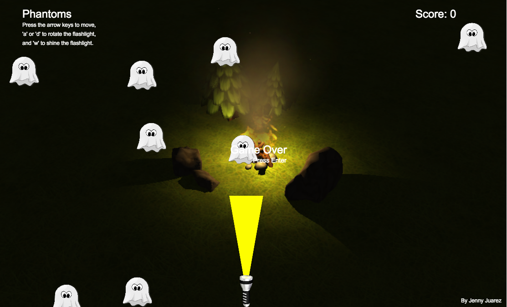

## Note this project is archived

# PHANTOMS

Phantoms is an interactive browser game inspired by Asteroids.

# QUICK START
To play, press the space bar to shine the flashlight and scare away the ghosts.
Use the 'a' key to travel left, 's' to stop moving, and 'd' to travel right.
Your score will increase based on the number of ghosts you've scared away.
If a ghost runs into the flashlight, it's game over.

[Live Demo](http://jennyj2012.github.io/phantoms/)

# FEATURES
 * Custom collision detection for rotated geometric shapes
 * Rotation and keyboard movement of flashlight synchronized with flashlight beam

# OVERVIEW
A rotational matrix was implemented in accordance with a left-handed Cartesian coordinate system to detect collisions between the phantoms and the player. Angles were converted between 0 and 360 degrees to maintain consistent comparisons. Collisions between the flashlight beam and the phantoms were detected using distance and by calculating the offset inverse tangent (x axis over y axis instead of y axis over x) between the two points.

## TECHNOLOGIES
  * HTML5 Canvas
  * Javascript
  * keymaster.js, a simple micro-library for defining and dispatching keyboard shortcuts.

Developed by Jenny Juarez
